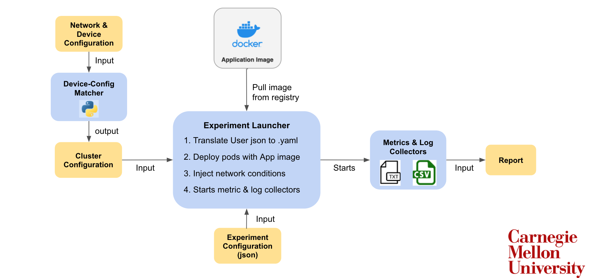
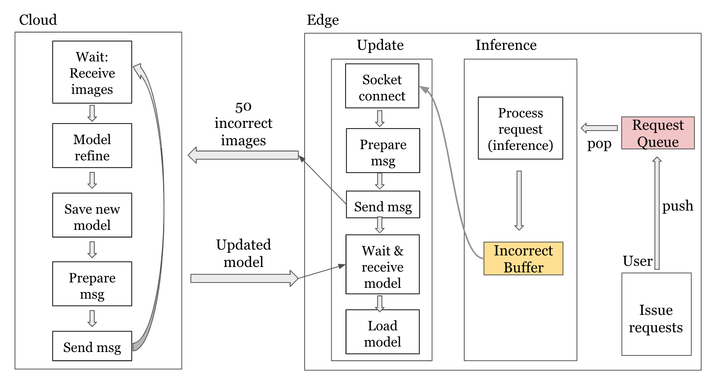
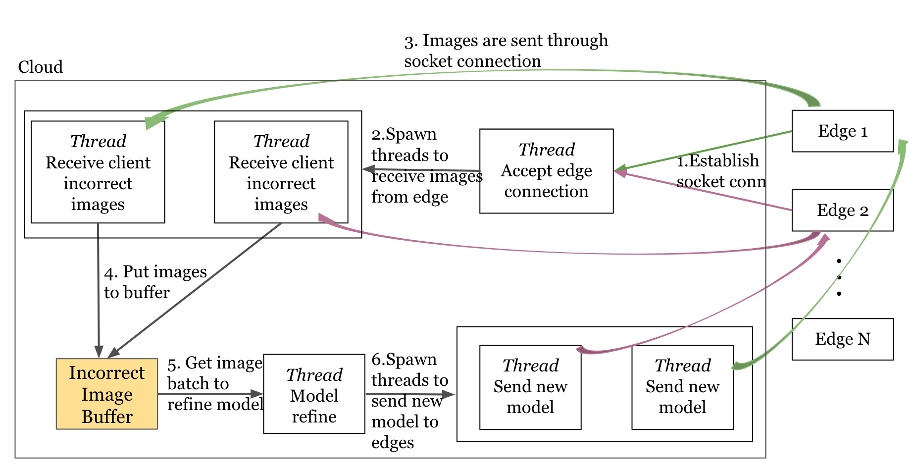

# Cloud Edge App Emulator Using Kubernetes

The project of cloud-edge emulator and the sample workload: a video surveillance application based on YOLOv3 model. Major contents (application itself and experiment launcher) reside in `/YOLOv3_Train_Inference` folder. The system is designed as:




# Deployment

To deploy an cloud application using the Cloud-Edge Emulator, you first need to create an experiment configuration file. A sample config file can be found at [user_config](YOLOv3_Train_Inference/user_config.json). The information to contain includes machines involved in the application deployment and the connections between them with the constraints specified.

To launch an experiment on our sample workload YoloV3, you can use the command
```
cd YOLOv3_Train_Inference
mkdir logs
python3 deploy.py logs user_config.json
```
A more generalized command is
```
python3 YOLOv3_Train_Inference/deploy.py <path to the directory to store logs> <path to the config file>
```

The logs will be copied from its NFS mounted location to the directory assigned by the user every 10 seconds. The realtime CPU and memory consumption of each machine specified in user-input config file will be recorded in the log folder as well.

> Note: Before conducting experiments, check the resource availability on the node as other users might also be running jobs. Also, check that Phoebe has acceptable network connections.

# Sample Application

On the cloud (server) side, it receives incorrect images from clients, does model retrain, and sends updated model back. The cloud implementation supports either CPU or GPU mode and will detect and use GPU resource automatically if any is available. On the edge (client) side, the client tries to fetch image from "emulated user", do inferences on image, and collect incorrect images, and communicates with cloud when there is certain number of incorrect images. Please note that client only supports CPU mode.

The two-pod (one cloud and one edge) application implementation is:



And the multi-pod (one cloud and multi edges) application implementation is (edge side unchanged):



## Application Arguments
1. Cloud program arguments

Sample cmd: 
```
python3 /app/cloud_yolo_train_update.py 9876 logs/cloud.log logs/cloud.csv
```

Interpretation: 
```
python3 [program loc] [cloud port] [cloud log output path] [cloud timestamp csv output path]
```

2. Edge program arguments

Sample cmd: 
```
python3 /app/edge_yolo_inference.py 110.13.203.03 9876 edge_inf.log edge_update.log edge_inf.csv edge_update.csv 1 0
```

Interpretation: 
```
python3 [program loc] [cloud ip] [cloud port] edge_inf.log edge_update.log edge_inf.csv edge_update.csv [request per sec] [edge id]
```

> Note:
>> i) if testing locally, please set `[cloud ip]` as `local`;\
>> ii) log and csv arguments are fixed in the edge program which will be directed to `logs/[edge id]` folder

## Docker Images
1. `docker.io/churong/yolo:v2`: Two-pod application Image


2. `docker.io/churong/yolo:multi-pod`: Multi-pod application image requiring that cloud retrain only happens when num of incorrect images in the cloud >= 100


3. `docker.io/churong/yolo:multi-pod-no-limit-retrain`: Multi-pod application image with no image number restrictions on cloud retrain


4. `docker.io/churong/yolo:multi-pod-gpu`: Multi-pod application with no image number restrictions on cloud retrain & GPU support for cloud retrain

> Note: Anonymous and Free Docker Hub users are limited to 100 and 200 container image pull requests per six hours. This applies for all images pulls in the Phoebe (not only yolo image pulls). Thus, please do not pull frequently from the remote docker registry. Instead, try to use Phoebe's docker registry (Refer to: [Phoebe docker registry guidance](https://wiki.pdl.cmu.edu/Phoebe/UserGuide#Docker_registry)).
